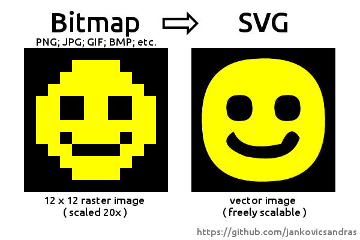
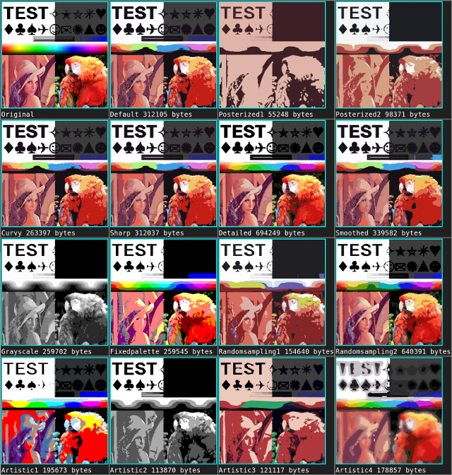

# imagetracerjs


Simple raster image tracer and vectorizer written in JavaScript.

---

## Table of contents
- [Getting started](#getting-started)
- [News](#news)
- [API](#api)
- [Options](#options)
- [Examples](#examples)
- [Process overview](#process-overview)
- [License](#license)

---

## Getting started

### Using in the Browser
Include the script:
```javascript
<script src="imagetracer_v1.2.6.js"></script>
```
Then:
```javascript
// Loading an image, tracing with the 'posterized2' option preset, and appending the SVG to an element with id="svgcontainer"
ImageTracer.imageToSVG(

	'panda.png', /* input filename / URL */
	
	function(svgstr){ ImageTracer.appendSVGString( svgstr, 'svgcontainer' ); }, /* callback function to run on SVG string result */
	
	'posterized2' /* Option preset */
	
);
```

### Using with Node.js

Node.js Command line interface example:

```
imagetracerjs/nodecli>node nodecli ../panda.png outfilename panda.svg scale 10
```

Expected result:

```
imagetracerjs/nodecli/panda.svg was saved!
```

---

## News

### 1.2.6
 - FIXED: hole shape parent search (Issues #31 #39)
 - FIXED: Handle (absolute) paths in CLI correctly Issue #42

### 1.2.5
 - RGBA ImageData check in colorquantization(), solving Issue #24 and #18

### 1.2.4
 - ```options.layering``` : default 0 = sequential, new method ; 1 = parallel, old method. (Enhancement Issue #17)
 - case insensitive option preset names
 - README.md reorganizing

[Version history](https://github.com/jankovicsandras/imagetracerjs/blob/master/version_history.md)

---

## API
|Function name|Arguments|Returns|Run type|
|-------------|---------|-------|--------|
|```imageToSVG```|```image_url /*string*/ , callback /*function*/ , options /*optional object or preset name*/```|Nothing, ```callback(svgstring)``` will be executed|Asynchronous, Browser only|
|```imagedataToSVG```|```imagedata /*object*/ , options /*optional object or preset name*/```|```svgstring /*string*/```|Synchronous, Browser & Node.js|
|```imageToTracedata```|```image_url /*string*/ , callback /*function*/ , options /*optional object or preset name*/```|Nothing, ```callback(tracedata)``` will be executed|Asynchronous, Browser only|
|```imagedataToTracedata```|```imagedata /*object*/ , options /*optional object or preset name*/```|```tracedata /*object*/```|Synchronous, Browser & Node.js|

```imagedata``` is standard [ImageData](https://developer.mozilla.org/en-US/docs/Web/API/ImageData) here, ```canvas``` is [canvas](https://developer.mozilla.org/en-US/docs/Web/HTML/Element/canvas) .

### Helper Functions (Browser only)
|Function name|Arguments|Returns|Run type|
|-------------|---------|-------|--------|
|```appendSVGString```|```svgstring /*string*/, parentid /*string*/```|Nothing, an SVG will be appended to the container DOM element with id=parentid.|Synchronous, Browser only|
|```loadImage```|```url /*string*/, callback /*function*/```|Nothing, loading an image from a URL, then executing ```callback(canvas)```|Asynchronous, Browser only|
|```getImgdata```|```canvas /*object*/```|```imagedata /*object*/```|Synchronous, Browser only|

```imagedata``` is standard [ImageData](https://developer.mozilla.org/en-US/docs/Web/API/ImageData) here, ```canvas``` is [canvas](https://developer.mozilla.org/en-US/docs/Web/HTML/Element/canvas) .
There are more functions for advanced users, read the source if you are interested. :)

"Browser only" means that Node.js doesn't have built-in canvas and DOM support as of 2018, so loading an image to an ImageData object needs an external library. 

---

## Options
You can use an option preset name (string) or an [options object](https://github.com/jankovicsandras/imagetracerjs/blob/master/options.md) to control the tracing and rendering process.



These strings can be passed instead of the options object:
```'default'```
```'posterized1'```
```'posterized2'```
```'posterized3'```
```'curvy'```
```'sharp'```
```'detailed'```
```'smoothed'```
```'grayscale'```
```'fixedpalette'```
```'randomsampling1'```
```'randomsampling2'```
```'artistic1'```
```'artistic2'```
```'artistic3'```
```'artistic4'```

[Read more about options.](https://github.com/jankovicsandras/imagetracerjs/blob/master/options.md)

---

## Examples

### Using in the Browser
Include the script:
```javascript
<script src="imagetracer_v1.2.6.js"></script>
```
Then
```javascript
// Loading smiley.png, tracing and calling alert callback on the SVG string result 
ImageTracer.imageToSVG( 'smiley.png', alert );


// Almost the same with options, and the ImageTracer.appendSVGString callback will append the SVG
ImageTracer.imageToSVG( 'smiley.png', ImageTracer.appendSVGString, { ltres:0.1, qtres:1, scale:10, strokewidth:5 } );


// This uses the 'posterized2' option preset and appends the SVG to an element with id="svgcontainer"
ImageTracer.imageToSVG(
	'panda.png',
	function(svgstr){ ImageTracer.appendSVGString( svgstr, 'svgcontainer' ); },
	'posterized2'
);


// The helper function loadImage() loads an image to a canvas, then executing callback:
// appending the canvas to a div here.
ImageTracer.loadImage(
	'panda.png',
	function(canvas){ (document.getElementById('canvascontainer')).appendChild(canvas); }
);


// ImageData can be traced to an SVG string synchronously.
ImageTracer.loadImage(
	'smiley.png',
	function(canvas){
	
		// Getting ImageData from canvas with the helper function getImgdata().
	 	var imgd = ImageTracer.getImgdata( canvas );
	 	
	 	// Synchronous tracing to SVG string
	 	var svgstr = ImageTracer.imagedataToSVG( imgd, { scale:5 } );
	 
	 	// Appending SVG
	 	ImageTracer.appendSVGString( svgstr, 'svgcontainer' );
	 	
	}
);


// This will load an image, trace it when loaded, and execute callback on the tracedata:
// stringifying and alerting it here.
ImageTracer.imageToTracedata(
	'smiley.png',
	function(tracedata){ alert( JSON.stringify( tracedata ) ); },
	{ ltres:0.1, qtres:1, scale:10 }
);


// imagedataToTracedata() is very similar to the previous functions. This returns tracedata synchronously.
ImageTracer.loadImage(
		'smiley.png',
		function(canvas){ 
		
			// Getting ImageData from canvas with the helper function getImgdata().
			var imgd = ImageTracer.getImgdata(canvas);
			
			// Synchronous tracing to tracedata
			var tracedata = ImageTracer.imagedataToTracedata( imgd, { ltres:1, qtres:0.01, scale:10 } );
			
			alert( JSON.stringify( tracedata ) );
		}
);
```

### Using with Node.js CLI

Node.js Command line interface example:

```
imagetracerjs/nodecli>node nodecli ../panda.png outfilename panda.svg scale 10
```

Expected result:

```
imagetracerjs/nodecli/panda.svg was saved!
```

CLI parameter names are supported both with and without trailing dash: ```-scale 10``` and ```scale 10``` are both correct.
Almost all options are supported, except ```pal``` and ```layercontainerid```.

### Simple Node.js converting example

```javascript
"use strict";

var fs = require('fs');

var ImageTracer = require( __dirname + '/../imagetracer_v1.2.6' );

// This example uses https://github.com/arian/pngjs 
// , but other libraries can be used to load an image file to an ImageData object.
var PNGReader = require( __dirname + '/PNGReader' );

// Input and output filepaths / URLs
var infilepath = __dirname + '/' + 'panda.png';
var outfilepath = __dirname + '/' + 'panda.svg';


fs.readFile(
		
	infilepath,
	
	function( err, bytes ){ // fs.readFile callback
		if(err){ console.log(err); throw err; }
	
		var reader = new PNGReader(bytes);
	
		reader.parse( function( err, png ){ // PNGReader callback
			if(err){ console.log(err); throw err; }
			
			// creating an ImageData object
			var myImageData = { width:png.width, height:png.height, data:png.pixels };
			
			// tracing to SVG string
			var options = { scale: 5 }; // options object; option preset string can be used also
			
			var svgstring = ImageTracer.imagedataToSVG( myImageData, options );
			
			// writing to file
			fs.writeFile(
				outfilepath,
				svgstring,
				function(err){ if(err){ console.log(err); throw err; } console.log( outfilepath + ' was saved!' ); }
			);
			
		});// End of reader.parse()
		
	}// End of readFile callback()
	
);// End of fs.readFile()
```

---

## Process overview
See [Process overview and Ideas for improvement](https://github.com/jankovicsandras/imagetracerjs/blob/master/process_overview.md)

---

## License
### The Unlicense / PUBLIC DOMAIN

This is free and unencumbered software released into the public domain.

Anyone is free to copy, modify, publish, use, compile, sell, or
distribute this software, either in source code form or as a compiled
binary, for any purpose, commercial or non-commercial, and by any
means.

In jurisdictions that recognize copyright laws, the author or authors
of this software dedicate any and all copyright interest in the
software to the public domain. We make this dedication for the benefit
of the public at large and to the detriment of our heirs and
successors. We intend this dedication to be an overt act of
relinquishment in perpetuity of all present and future rights to this
software under copyright law.

THE SOFTWARE IS PROVIDED "AS IS", WITHOUT WARRANTY OF ANY KIND,
EXPRESS OR IMPLIED, INCLUDING BUT NOT LIMITED TO THE WARRANTIES OF
MERCHANTABILITY, FITNESS FOR A PARTICULAR PURPOSE AND NONINFRINGEMENT.
IN NO EVENT SHALL THE AUTHORS BE LIABLE FOR ANY CLAIM, DAMAGES OR
OTHER LIABILITY, WHETHER IN AN ACTION OF CONTRACT, TORT OR OTHERWISE,
ARISING FROM, OUT OF OR IN CONNECTION WITH THE SOFTWARE OR THE USE OR
OTHER DEALINGS IN THE SOFTWARE.

For more information, please refer to [http://unlicense.org](http://unlicense.org)
