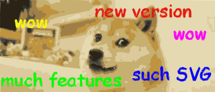

# imagetracerjs


Simple raster image tracer and vectorizer written in JavaScript.

by András Jankovics 2015, 2016

### 1.1.0 is here

- it works with Node.js (external library required to load image into an ImageData object)
- export as AMD module / Node module / browser or worker variable
- new syntax: ImageTracer.imageToTracedata(), no need to initialize
- fixed options with hasOwnProperty: 0 values are not replaced with defaults, fixed polygons with coordinates x=0 or y=0
- transparency support: alpha is not discarded now, it is given more weight in color quantization
- new options.roundcoords : rounding coordinates to a given decimal place. This can reduce SVG length significantly (>20%) with minor loss of precision.
- new options.desc : setting this to false will turn off path descriptions, reducing SVG length.
- new options.viewbox : setting this to true will use viewBox instead of exact width and height
- new options.colorsampling : color quantization will sample the colors now by default, can be turned off.
- new options.blurradius : setting this to 1..5 will preprocess the image with a selective Gaussian blur with options.blurdelta treshold. This can filter noise and improve quality.
- imagedataToTracedata() returns image width and height in tracedata
- getsvgstring() needs now only tracedata and options as parameters
- colorquantization() needs now only imgd and options as parameters
- background field is removed from the results of color quantization and 
- ESLint passed
- test automation and simple statistics in imagetracer_test_automation.html



### Using in the browser
Include the script:
```javascript
<script src="imagetracer_v1.1.0.js"></script>
```
Then
```javascript
// Loading smiley.png, tracing and calling alert callback on the SVG string result 
ImageTracer.imageToSVG( 'smiley.png', alert );
```
More examples:
```javascript

// Almost the same with options, and the ImageTracer.appendSVGString callback will append the SVG
ImageTracer.imageToSVG( 'smiley.png', ImageTracer.appendSVGString, { ltres:0.1, qtres:1, scale:10 } );


// This appends the SVG to an element with id="svgcontainer"
ImageTracer.imageToSVG(
	'panda.png',
	function(svgstr){ ImageTracer.appendSVGString( svgstr, 'svgcontainer' ); },
	{ numberofcolors:4 }
);


// The helper function loadImage() loads an image to a canvas, then executing callback:
// appending the canvas to a div here.
ImageTracer.loadImage(
	'panda.png',
	function(canvas){ (document.getElementById('canvascontainer')).appendChild(canvas); }
);


// ImageData can be traced to an SVG string synchronously.
ImageTracer.loadImage(
	'smiley.png',
	function(canvas){
	
		// Getting ImageData from canvas with the helper function getImgdata().
	 	var imgd = ImageTracer.getImgdata( canvas );
	 	
	 	// Synchronous tracing to SVG string
	 	var svgstr = ImageTracer.imagedataToSVG( imgd, { scale:5 } );
	 
	 	// Appending SVG
	 	ImageTracer.appendSVGString( svgstr, 'svgcontainer' );
	 	
	}
);


// This will load an image, trace it when loaded, and execute callback on the tracedata:
// stringifying and alerting it here.
ImageTracer.imageToTracedata(
	'smiley.png',
	function(tracedata){ alert( JSON.stringify( tracedata ) ); },
	{ ltres:0.1, qtres:1, scale:10 }
);


// imagedataToTracedata() is very similar to the previous functions. This returns tracedata synchronously.
ImageTracer.loadImage(
		'smiley.png',
		function(canvas){ 
		
			// Getting ImageData from canvas with the helper function getImgdata().
			var imgd = ImageTracer.getImgdata(canvas);
			
			// Synchronous tracing to tracedata
			var tracedata = ImageTracer.imagedataToTracedata( imgd, { ltres:1, qtres:0.01, scale:10 } );
			
			alert( JSON.stringify( tracedata ) );
		}
);
```

### Using with Node.js
See nodetest folder. Example:
```javascript
"use strict";

var fs = require("fs");

var ImageTracer = require(__dirname +'/../imagetracer_v1.1.0');

// This example uses https://github.com/arian/pngjs 
// , but other libraries can be used to load an image file to an ImageData object.
var PNGReader = require(__dirname +'/PNGReader');

var file = __dirname + "/../testimages/1.png";

fs.readFile(file, function(err, bytes){
	if (err) throw err;

	var reader = new PNGReader(bytes);

	reader.parse(function(err, png){
		if (err) throw err;
		
		// creating an ImageData object
		var myImageData = { 'width':png.width, 'height':png.height, 'data':png.pixels };
		
		// tracing
		var options = { 'ltres':0.1 }; // optional
		var svgstring = ImageTracer.imagedataToSVG( myImageData, options );
		
		// writing to file
		fs.writeFile(__dirname+"/test.svg", svgstring, function(err) {
			if (err) throw err;
			console.log(__dirname+"/test.svg was saved!");
		});
		
	});// End of reader.parse()

});// End of fs.readFile()

```

### Main Functions
|Function name|Arguments|Returns|Run type|
|-------------|---------|-------|--------|
|imageToSVG|image_url /*string*/ , callback /*function*/ , options /*optional object*/|Nothing, callback(svgstring) will be executed|Asynchronous|
|imagedataToSVG|[ImageData](https://developer.mozilla.org/en-US/docs/Web/API/ImageData) /*object*/ , options /*optional object*/|svgstring /*string*/|Synchronous|
|imageToTracedata|image_url /*string*/ , callback /*function*/ , options /*optional object*/|Nothing, callback(tracedata) will be executed|Asynchronous|
|imagedataToTracedata|[ImageData](https://developer.mozilla.org/en-US/docs/Web/API/ImageData) /*object*/ , options /*optional object*/|tracedata /*object*/|Synchronous|

	
#### Helper Functions
|Function name|Arguments|Returns|Run type|
|-------------|---------|-------|--------|
|appendSVGString|svgstring /*string*/, parentid /*string*/|Nothing, an SVG will be appended to the container div with id=parentid.|Synchronous|
|loadImage|url /*string*/, callback /*function*/|Nothing, loading an image from a URL, then executing callback(canvas)|Asynchronous|
|getImgdata|[canvas](https://developer.mozilla.org/en-US/docs/Web/HTML/Element/canvas) /*object*/|[ImageData](https://developer.mozilla.org/en-US/docs/Web/API/ImageData) /*object*/|Synchronous|

There are more functions for advanced users, read the source if you are interested. :)
	
### Options
|Option name|Default value|Meaning|
|-----------|-------------|-------|
|ltres|1|Error treshold for straight lines.|
|qtres|1|Error treshold for quadratic splines.|
|pathomit|8|Edge node paths shorter than this will be discarded for noise reduction.|
|blurradius|0|Set this to 1..5 for selective Gaussian blur preprocessing.|
|blurdelta|20|RGBA delta treshold for selective Gaussian blur preprocessing.|
|pal|No default value|Custom palette, an array of color objects: ```[ {r:0,g:0,b:0,a:255}, ... ]```|
|numberofcolors|16|Number of colors to use on palette if pal object is not defined.|
|mincolorratio|0.02|Color quantization will randomize a color if fewer pixels than (total pixels*mincolorratio) has it.|
|colorquantcycles|3|Color quantization will be repeated this many times.|
|scale|1|Every coordinate will be multiplied with this, to scale the SVG.|
|colorsampling|true|Enable or disable color sampling.|
|viewbox|false|Enable or disable SVG viewBox.|
|desc|true|Enable or disable SVG descriptions.|
|lcpr|0|Straight line control point radius, if this is greater than zero, small circles will be drawn in the SVG. Do not use this for big/complex images.|
|qcpr|0|Quadratic spline control point radius, if this is greater than zero, small circles and lines will be drawn in the SVG. Do not use this for big/complex images.|
|layercontainerid|No default value|Edge node layers can be visualized if a container div's id is defined.|

The almost complete options object:	
```javascript
var options = {"ltres":1,"qtres":1,"pathomit":8,"colorsampling":true,"numberofcolors":16,"mincolorratio":0.02,"colorquantcycles":3,"scale":1,"simplifytolerance":0,"roundcoords":1,"lcpr":0,"qcpr":0,"desc":true,"viewbox":false,"blurradius":0,"blurdelta":20};
```
Adding custom palette. This will override numberofcolors.
```javascript
options.pal = [{r:0,g:0,b:0,a:255}, {r:0,g:0,b:255,a:255}, {r:255,g:255,b:0,a:255}];
```

### Process overview
See [Process overview and Ideas for improvement](https://github.com/jankovicsandras/imagetracerjs/blob/master/process_overview.md)

### License
#### The Unlicense / PUBLIC DOMAIN

This is free and unencumbered software released into the public domain.

Anyone is free to copy, modify, publish, use, compile, sell, or
distribute this software, either in source code form or as a compiled
binary, for any purpose, commercial or non-commercial, and by any
means.

In jurisdictions that recognize copyright laws, the author or authors
of this software dedicate any and all copyright interest in the
software to the public domain. We make this dedication for the benefit
of the public at large and to the detriment of our heirs and
successors. We intend this dedication to be an overt act of
relinquishment in perpetuity of all present and future rights to this
software under copyright law.

THE SOFTWARE IS PROVIDED "AS IS", WITHOUT WARRANTY OF ANY KIND,
EXPRESS OR IMPLIED, INCLUDING BUT NOT LIMITED TO THE WARRANTIES OF
MERCHANTABILITY, FITNESS FOR A PARTICULAR PURPOSE AND NONINFRINGEMENT.
IN NO EVENT SHALL THE AUTHORS BE LIABLE FOR ANY CLAIM, DAMAGES OR
OTHER LIABILITY, WHETHER IN AN ACTION OF CONTRACT, TORT OR OTHERWISE,
ARISING FROM, OUT OF OR IN CONNECTION WITH THE SOFTWARE OR THE USE OR
OTHER DEALINGS IN THE SOFTWARE.

For more information, please refer to [http://unlicense.org](http://unlicense.org)
