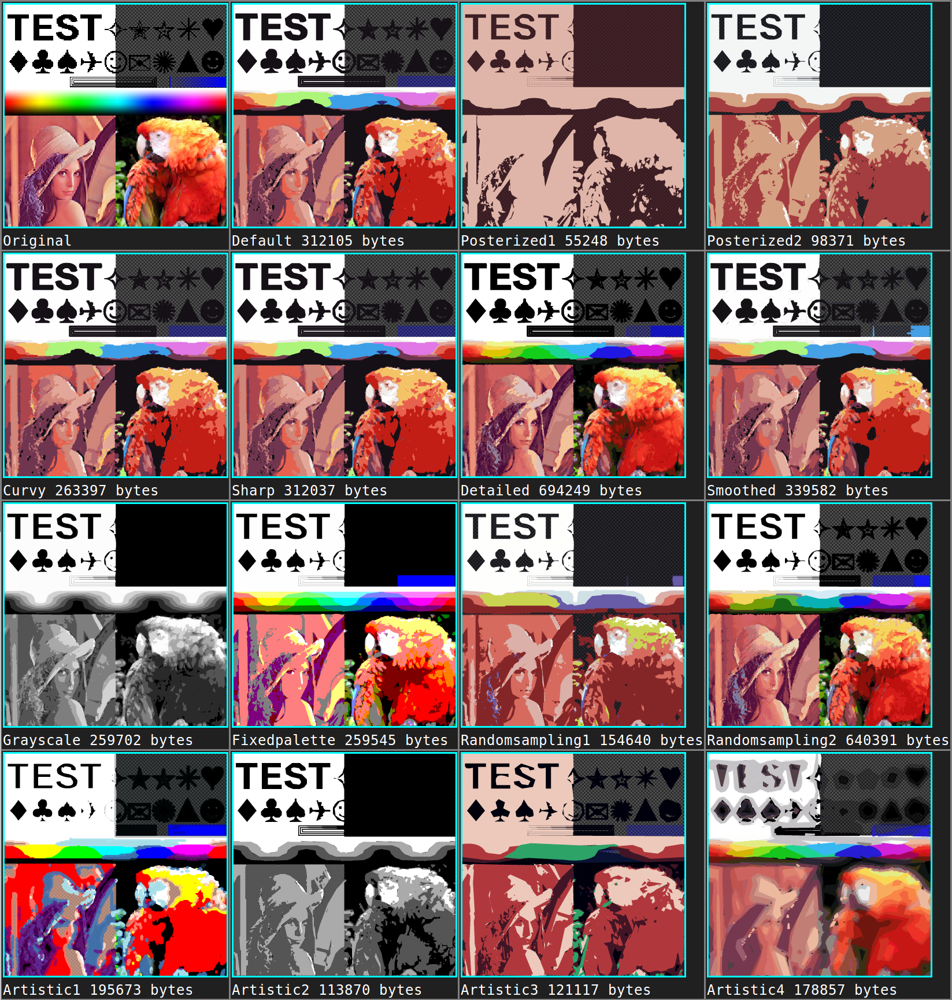

## Options

Using a custom options object:
```javascript
var options = { ltres:2, qtres:1, pathomit:8 }; // Any option can be omitted which will be set to the default

// Adding custom palette. This will override numberofcolors.
options.pal = [{r:0,g:0,b:0,a:255}, {r:0,g:0,b:255,a:255}, {r:255,g:255,b:0,a:255}];

// Using these options and appending the SVG to an element with id="svgcontainer"
ImageTracer.imageToSVG(
	'panda.png', /* input filename / URL */
	
	function(svgstr){ ImageTracer.appendSVGString( svgstr, 'svgcontainer' ); }, /* callback function on SVG string result */
	
	options /* custom options object */
);
```

#### Tracing

|Option name|Default value|Meaning|
|-----------|-------------|-------|
|```corsenabled```|```false```|Enable or disable [CORS Image loading](https://developer.mozilla.org/en-US/docs/Web/HTML/CORS_enabled_image)|
|```ltres```|```1```|Error treshold for straight lines.|
|```qtres```|```1```|Error treshold for quadratic splines.|
|```pathomit```|```8```|Edge node paths shorter than this will be discarded for noise reduction.|
|```rightangleenhance```|```true```|Enhance right angle corners.|

#### Color quantization

|Option name|Default value|Meaning|
|-----------|-------------|-------|
|```colorsampling```|```2```|0: disabled, generating a palette; 1: random sampling; 2: deterministic sampling|
|```numberofcolors```|```16```|Number of colors to use on palette if pal object is not defined.|
|```mincolorratio```|```0```|Color quantization will randomize a color if fewer pixels than (total pixels*mincolorratio) has it.|
|```colorquantcycles```|```3```|Color quantization will be repeated this many times.|

#### Layering

|Option name|Default value|Meaning|
|-----------|-------------|-------|
|```layering```|```0```|0: sequential ; 1: parallel|

#### SVG rendering

|Option name|Default value|Meaning|
|-----------|-------------|-------|
|```strokewidth```|```1```|[SVG stroke-width](https://developer.mozilla.org/en-US/docs/Web/SVG/Attribute/stroke-width)|
|```linefilter```|```false```|Enable or disable line filter for noise reduction.|
|```scale```|```1```|Every coordinate will be multiplied with this, to scale the SVG.|
|```roundcoords```|```1```|rounding coordinates to a given decimal place. 1 means rounded to 1 decimal place like 7.3 ; 3 means rounded to 3 places, like 7.356|
|```viewbox```|```false```|Enable or disable SVG viewBox.|
|```desc```|```false```|Enable or disable SVG descriptions.|

#### Blur preprocessing

|Option name|Default value|Meaning|
|-----------|-------------|-------|
|```blurradius```|```0```|Set this to 1..5 for selective Gaussian blur preprocessing.|
|```blurdelta```|```20```|RGBA delta treshold for selective Gaussian blur preprocessing.|

#### Debug

|Option name|Default value|Meaning|
|-----------|-------------|-------|
|```layercontainerid```|No default value|Edge node layers can be visualized if a container div's id is defined.|
|```lcpr```|```0```|Straight line control point radius, if this is greater than zero, small circles will be drawn in the SVG. Do not use this for big/complex images.|
|```qcpr```|```0```|Quadratic spline control point radius, if this is greater than zero, small circles and lines will be drawn in the SVG. Do not use this for big/complex images.|

#### Initial palette

|Option name|Default value|Meaning|
|-----------|-------------|-------|
|```pal```|No default value|Custom palette, an array of color objects: ```[ {r:0,g:0,b:0,a:255}, ... ]```|

---

## Option presets



```javascript
	this.optionpresets = {
		'default': {
			
			// Tracing
			corsenabled : false,
			ltres : 1,
			qtres : 1,
			pathomit : 8,
			rightangleenhance : true,
			
			// Color quantization
			colorsampling : 2,
			numberofcolors : 16,
			mincolorratio : 0,
			colorquantcycles : 3,
			
			// Layering method
			layering : 0,
			
			// SVG rendering
			strokewidth : 1,
			linefilter : false,
			scale : 1,
			roundcoords : 1,
			viewbox : false,
			desc : false,
			lcpr : 0,
			qcpr : 0,
			
			// Blur
			blurradius : 0,
			blurdelta : 20
			
		},
		
		'posterized1': { colorsampling:0, numberofcolors:2 },
		
		'posterized2': { numberofcolors:4, blurradius:5 },
		
		'curvy': { ltres:0.01, linefilter:true, rightangleenhance:false },
		
		'sharp': { qtres:0.01, linefilter:false },
		
		'detailed': { pathomit:0, roundcoords:2, ltres:0.5, qtres:0.5, numberofcolors:64 },
		
		'smoothed': { blurradius:5, blurdelta: 64 },
		
		'grayscale': { colorsampling:0, colorquantcycles:1, numberofcolors:7 },
		
		'fixedpalette': { colorsampling:0, colorquantcycles:1, numberofcolors:27 },
		
		'randomsampling1': { colorsampling:1, numberofcolors:8 },
		
		'randomsampling2': { colorsampling:1, numberofcolors:64 },
		
		'artistic1': { colorsampling:0, colorquantcycles:1, pathomit:0, blurradius:5, blurdelta: 64, ltres:0.01, linefilter:true, numberofcolors:16, strokewidth:2 },
		
		'artistic2': { qtres:0.01, colorsampling:0, colorquantcycles:1, numberofcolors:4, strokewidth:0 },
		
		'artistic3': { qtres:10, ltres:10, numberofcolors:8 },
		
		'artistic4': { qtres:10, ltres:10, numberofcolors:64, blurradius:5, blurdelta: 256, strokewidth:2 },
		
		'posterized3': { ltres: 1, qtres: 1, pathomit: 20, rightangleenhance: true, colorsampling: 0, numberofcolors: 3,
			mincolorratio: 0, colorquantcycles: 3, blurradius: 3, blurdelta: 20, strokewidth: 0, linefilter: false,
			roundcoords: 1, pal: [ { r: 0, g: 0, b: 100, a: 255 }, { r: 255, g: 255, b: 255, a: 255 } ] }
			
	},// End of optionpresets
```
