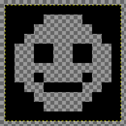
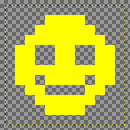
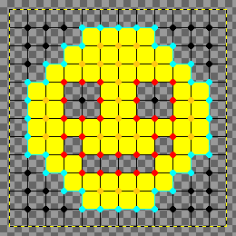
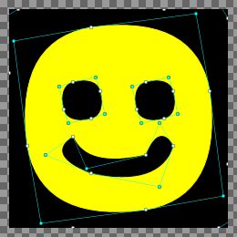

### Process overview
#### 1. Color quantization
The **colorquantization** function creates an indexed image (https://en.wikipedia.org/wiki/Indexed_color) using a variant of the https://en.wikipedia.org/wiki/K-means_clustering or https://en.wikipedia.org/wiki/K-medians_clustering algorithm. 

#### 2. Layer separation and edge detection
The **layering** function creates arrays for every color, and calculates edge node types. These are at the center of every 4 pixels, shown here as dots. This, **pathscan** and **interpolation** are a reinvented variant of the https://en.wikipedia.org/wiki/Marching_squares algorithm. 

#### 3. Pathscan
The **pathscan** function finds chains of edge nodes, example: the cyan dots and lines.

#### 4. Interpolation
The **internodes** function interpolates the coordinates of the edge node paths. Every line segment in the new path has one of the 8 directions (East, North East, N, NW, W, SW, S, SE).

#### 5. Tracing
The **tracepath** function splits the interpolated paths into sequences with two directions.

The **fitseq** function tries to fit a straight line on the start- and endpoint of the sequence (black line). If the distance error between the calculated points (black line) and actual sequence points (blue dots) is greater than the treshold, the point with the greatest error is selected (red line).

The **fitseq** function tries to fit a quadratic spline through the error point.

 

If the **fitseq** function can not fit a straight line or a quadratic spline to the sequence with the given error tresholds, then it will split the sequence in two and recursively call **fitseq** on each part (https://en.wikipedia.org/wiki/Divide_and_conquer_algorithm).

#### 6. SVG rendering
The coordinates are rendered to [SVG Paths](https://developer.mozilla.org/en-US/docs/Web/SVG/Tutorial/Paths) in the **getsvgstring** function.

### Ideas for improvement

- Error handling: there's very little error handling now, Out of memory can happen easily with big images or many layers.
- Color quantization: other algorithms e.g. https://en.wikipedia.org/wiki/Octree ?
- Color quantization: colors with few pixels are randomized, but probably the most distant colors should be found instead.
- Tracing: 5.1. finding more suitable sequences.
- Tracing: 5.5. splitpoint = fitpoint ; this is just a guess, there might be a better splitpoint.
- Tracing: 5.7. If splitpoint-endpoint is a spline, try to add new points from the next sequence; this is not implemented.
- Tracing: cubic splines or other curves?
- Default values: they are chosen because they seemed OK, not based on calculations.
- Output: [PDF](https://en.wikipedia.org/wiki/Portable_Document_Format), [DXF](https://en.wikipedia.org/wiki/AutoCAD_DXF),   [G-code](https://en.wikipedia.org/wiki/G-code) or other output?
- comparing and integrating ideas from https://en.wikipedia.org/wiki/Potrace
- Pathomit with background hole path shrinking 
